# NovaTrip by Team EyeScream

**Team:** Yap Li Shan, Chan Min Huey

**Problem Statement:** Travel Planner

**Video Presentation:** <u>Unlisted Youtube Link</u>

**Presentation Slides: [Canva Link](https://www.canva.com/design/DAHU6XS3EJk/EKB2IDizf7j8-QgmCtF-Qg/edit)**

## 1. Project Overview

### 1.1 The Problem 

Planning a trip involves keeping track of bookings, routes, activities, costs and personal preferences. When this information is spread across booking websites, maps, documents and messaging apps, travellers have to bring it together manually. Updating one part of the trip can also mean checking and changing information in several places.

Group trips add another challenge. Members may have different budgets, interests and preferred travel speeds. The organiser has to collect their answers, compare options and discuss changes before the group can choose a shared plan. Solo travellers face many of the same planning tasks but have to manage them on their own.

Unexpected changes make this harder during the trip. A delay, long queue or attraction closure can affect later activities and fixed bookings. Travellers must find alternatives, check travel times and rearrange the schedule. Group members also need to know which version of the itinerary to follow.

**Key Stakeholders**:

- **Primary Trip Organizers & Solo Travelers**: Carry the main burden of planning routes, tracking budgets, and handling unexpected changes when schedules are disrupted.

- **Group Members**: May struggle with too many choices, concerns about sharing their personal budgets, and disagreements during group decisions.

This can lead to repeated planning work, missed activities, booking conflicts, overspending and disagreements about shared costs.

While **Wanderlog** offers collaborative mapping and expense tracking, its schedules remain static and require manual rescheduling during disruptions. **TripIt** excels at aggregating booking emails into shared trips, but mainly acts as a passive itinerary viewer. It alerts users about flight delays without recalculating downstream ground plans or providing group decision-making tools. Similarly, **Sygic Travel** provides strong geographic route optimization and trip sharing, but lacks support for group consensus, in-app communication, and dynamic replanning.

Overall, these platforms treat travel plans as static documents rather than living operational workspaces, leaving travelers to manually manage disruptions across multiple fragmented apps.

### 1.2 Our Solution

<a href="assets/media/image1.png">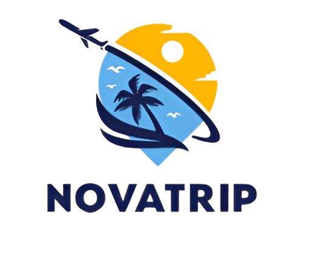</a>

NovaTrip is an all-in-one collaborative travel app that brings group planning, on-the-go trip management, budgeting, and shared memories into one low-cognitive-load mobile platform. It bridges the gap between static travel plans and real-world changes by turning individual preferences into a shared travel plan and the itinerary into an active hub for the whole group. Designed for both friend groups and solo travelers, NovaTrip aims to reduce switching between apps, make group choices clearer, and help travelers adjust their itineraries and track spending.

**Core Feature-Set:**

1.  **Guided Preference Profiling & Must-Do Curation**

A simple 4-step questionnaire captures each traveler's preferred trip style: pacing (Relaxed, Packed, or Immersive), top travel priorities (Food, Activities, Photo spots, Shopping), dining preferences, and specific landmark "must-dos" (e.g., Senso-ji, Tokyo Skytree). An optional Notes field on the food preference screen lets users add specific food requests or items to avoid that are not covered by the listed options. Each traveller can enter a personal budget for the whole trip or select No preference if they do not want to set a spending limit. Their budget choice is private and is used alongside their other preferences during planning. These inputs are used as the starting point for generating the group's itinerary options.

2.  **AI 3-Blueprint Synthesis & Group Voting**

The AI uses members’ preferences, any personal budgets they have provided, and existing bookings to generate three itinerary options: Group Favourite, Budget Smart, and Easy Pace. Members can compare the options using a "Compare at a glance" matrix, including estimated total cost, number of activities, and pace rating. For group trips, members vote for a plan or select No preference. Total vote counts are visible, while individual voters’ names are hidden. Solo travelers choose a plan directly.

3.  **Living Vertical Timeline & Live Cockpit**

The app provides three main views: Today, Full Trip, and Map. The Today view features a sticky "NOW" cockpit with live transit status (e.g., Narita Express ON TIME), arrival countdowns, platform and seat details, and direct Google Maps navigation links. Upcoming activities are automatically organised into "Next" and "Later today", with walking time between stops, dining cost information, and booking confirmation tags.

4.  **Multi-Platform Price Comparison & Ticket Ingestion Hub**

The app compares accommodation prices from major OTAs such as Agoda, Trip.com, and Booking.com in both list and map views. For bookings made outside the app, users can upload ticket PDFs or screenshots through the "Mark as booked" workflow. Uploaded ticket PDFs or screenshots are ingested via smart ticket scanning to automatically extract booking references, times, and amounts. Users can then choose to add the expense to the shared ledger with a one-tap toggle.

5.  **Context-Aware Replanning & Event-Driven Workspace**

An AI-powered coordination hub combines group messaging with interactive system action cards. When disruptions occur, travelers can open the Trip Assistant from the itinerary view and tap the one-touch "Reschedule my itinerary" button or provide a voice/text input. The AI Copilot checks how the change affects the remaining itinerary and presents a Before/After proposal that takes existing bookings into account. For group trips, confirming the proposal creates an “Approve changes” or “Keep original itinerary” poll in Trip Chat. The current itinerary remains unchanged while voting is pending. Solo travelers confirm their own changes without a group poll. The workspace also includes collaborative photo drop alerts within the chat.

6.  **Stop-Linked Ledger & Smart Net Debt Settlement**

Users can select an itinerary item to pre-fill an expense or add other expenses separately. They check the amount, payer and participants before saving, with equal or custom splits available for shared costs. The ledger tracks overall trip spending against the estimated budget and calculates how much each member owes or should receive. It provides peer balance cards with itemised expenses, one-tap "Remind" alerts, and “Mark as settled” to record payments made outside the app.

7.  **Interactive Footprint Scrapbook & Keepsake Postcards**

The app organises trip photos by itinerary stops and location, which can be viewed through interactive map pins or a chronological day-by-day album. Users can export customised keepsakes through the built-in "Create postcard" generator using Map-trail, Classic, or Collage templates for easy sharing and downloading.

## 2. Ideation & Process

### 2.1 Ideas We Considered
We first compared the two problem statements and chose the one that our team was more familiar with. We then discussed how travellers would create a trip, choose a plan, manage bookings and costs, and handle changes during the trip.

Our main considerations were whether an idea addressed a clear user need, made the trip easier to manage, and suited our team’s time and resources. The table below lists the ideas we kept first, followed by the approaches we decided not to use.

| **Idea**                                                        | **Status (Kept / Dropped)** | **Why it was dropped / kept**                                                                                                                                                                                                                                                                                                    |
|-----------------------------------------------------------------|-----------------------------|----------------------------------------------------------------------------------------------------------------------------------------------------------------------------------------------------------------------------------------------------------------------------------------------------------------------------------|
| Choose the Travel Planner problem statement                     | Kept                        | Our team had more experience with travel planning apps and the tasks involved in planning a trip. This made it easier for us to discuss real situations and check whether our design would be useful. We chose this direction so we could work on a problem we understood better.                                                |
| Offer both manual and AI-assisted trip creation                 | Kept                        | Our first design only allowed manual trip creation, while AI was used for itinerary changes. We later added AI to trip creation so users could describe their plans in their own words. We also kept the manual form for users who prefer to fill in clear fields.                                                               |
| Generate three plans with different priorities                  | Kept                        | We first planned to generate one best itinerary. However, group members may have different views on cost, pace, and activities. We changed this to three plans so users could compare the choices and decide which trade-offs suited their trip.                                                                                 |
| Start with an Android mobile app                                | Kept                        | Android allows us to develop on Windows and test through an emulator or an available Android device. We can build an APK for demonstrations while keeping the main app design and workflows. iOS support can be considered later when the required resources are available.                                                      |
| Allow users to create a trip without fixed dates                | Kept                        | Some users know where they want to go and how many days they have but have not chosen the dates. Allowing them to enter the trip length first lets them start planning earlier. Exact dates can be added later, although date-based bookings and availability still need confirmed dates.                                        |
| Plan around existing bookings                                   | Kept                        | Some users already have flights, hotels, or tickets before they start planning the rest of the trip. We decided to include these bookings as planning inputs so the AI can work around fixed times and locations.                                                                                                                |
| Upload booking documents, then review the filled details        | Kept                        | Typing every booking detail takes time and can lead to mistakes. We changed the manual-only approach to allow users to upload a ticket, screenshot, or PDF and review the extracted details. Manual entry remains available for corrections, missing information, or users who do not have a file.                               |
| Support individual expenses and flexible group splits           | Kept                        | We first considered splitting every expense equally among all members. However, some travellers may skip an activity or pay for something only for themselves. We added individual expenses, selected participants, and custom amounts so the recorded costs can reflect who actually shares each expense.                       |
| Show total vote counts while keeping voters’ identities private | Kept                        | We discussed whether users should see how many votes each plan received. We chose to show the totals so members can see the current support for each option, while keeping individual choices private.                                                                                                                           |
| Include Explore for travel ideas and guides                     | Kept                        | Explore was not part of the first design. We added it because users may not know which places or activities interest them yet. Letting them browse ideas and save places within the app reduces the need to move between travel research and their trip plan.                                                                    |
| Include a shared Trip Album                                     | Kept                        | We initially left out the album because storing many photos would add cost and extra work. We later kept it because members could collect and view trip photos without setting up a separate shared folder or sending files to each other. Photo storage, upload limits, and costs still need to be addressed in the build plan. |
| Include Trip Chat within the trip                               | Kept                        | The first design did not include chat. We added it so members could discuss the trip alongside the itinerary and its updates. This reduces the need to create a new group chat for travel decisions.                                                                                                                             |
| Offer a personal budget with a No preference option             | Kept                        | During our documentation review, we noticed that users could compare plan costs but had no place to enter their own budgets. We added this choice to Step 2 so planning could consider different spending limits while allowing users without a fixed budget to continue.                                                        |
| Use a website as the main platform for the prototype phase      | Dropped for this phase      | A website was an option, including use through a phone browser. We chose a mobile app, with Android as the first build target.                                                                                                                                                                                                   |
| Choose the Stress & Workload Manager problem statement          | Dropped                     | Our team had less experience using tools for stress and workload management. We felt that we would need more background research before making clear design decisions in this area. We chose Travel Planner because it was closer to our existing experience.                                                                    |
| Allow only manual trip creation                                 | Dropped                     | We added AI-assisted trip creation so users could describe their plans in their own words instead of filling in every field manually. We removed the manual-only limit while keeping manual creation as an option.                                                                                                               |
| Generate only one best plan                                     | Dropped                     | One plan would hide the choices between a lower budget, a slower pace, and more activities. So, we replaced it with three plans that users can compare before choosing.                                                                                                                                                          |
| Require exact dates before users can start planning             | Dropped                     | This would stop users who only know their destination and trip length from exploring a plan. We made dates optional during trip creation and allowed users to add them when their plans become clearer.                                                                                                                          |

Our early design focused on manual trip creation, one AI-generated plan, and AI support only when an itinerary needed to change. Through discussion, we added more ways for users to make their own choices, like manual or AI-assisted creation, three plan options, flexible dates, and different ways to split costs.

We also expanded the design to support more of the trip. Existing bookings became part of planning, document uploads reduced repeated entry, Explore helped users find ideas, and Trip Chat and Trip Album brought discussions and photos into the same trip space.

Later mentor feedback led to further changes, including itinerary-change polls, free-text food preferences, and postcard creation. Section 2.3 records that feedback and how we responded.

### 2.2 Ideation Boards
**Board 1: Problem Tree & Root Cause Analysis**

<a href="assets/media/image2.png">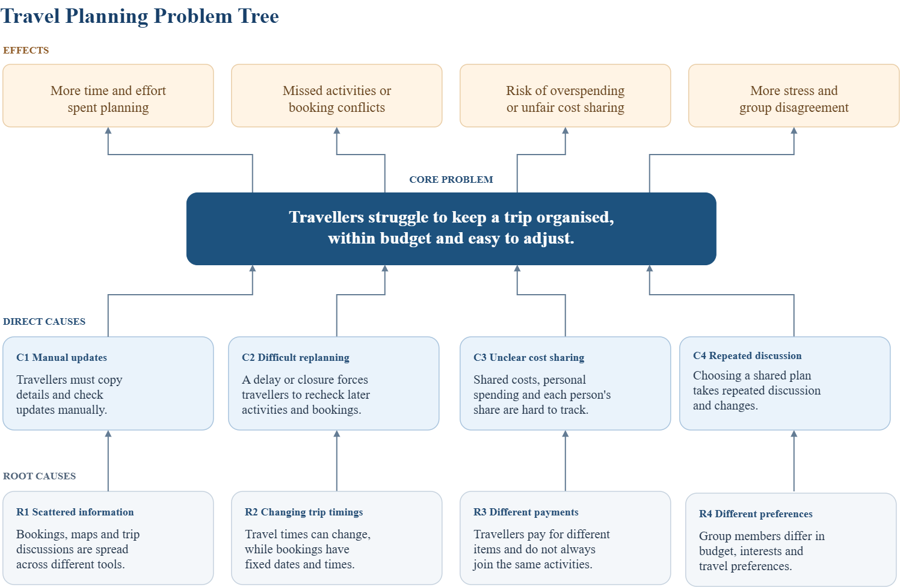</a>

This problem tree links scattered information, changing trip times, different payments and travel preferences to the difficulties travellers face. It helped our team focus NovaTrip on keeping trip details together, adjusting itineraries, tracking costs and supporting group decisions.

**Board 2: End-to-End Journey Flowchart (As-Is vs. To-Be)**

<a href="assets/media/image3.png">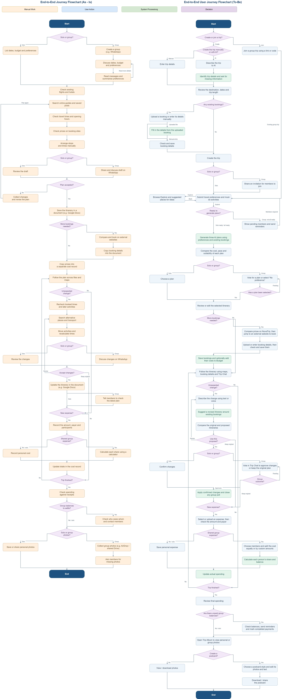</a>

These flowcharts compare planning across separate tools with the proposed NovaTrip journey for solo and group travellers. They show how our team designed AI planning, booking imports, group voting and cost calculations to reduce manual work while keeping users in control of their choices.

**Board 3: MindMap**

<a href="assets/media/image4.png">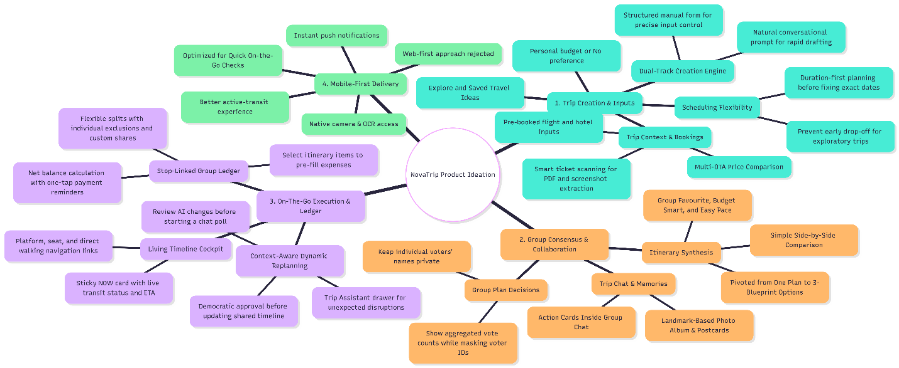</a>

This mind map connects our ideas for trip creation, group decisions, travel updates and mobile use. It also records key choices, including moving from one AI plan to three options and choosing a mobile app over a website for the first version.

### 2.3 Mentor Consultation
<table>
<colgroup>
<col style="width: 18%" />
<col style="width: 18%" />
<col style="width: 30%" />
<col style="width: 33%" />
</colgroup>
<tbody>
<tr class="odd">
<td><strong>Date</strong></td>
<td><strong>Mentor</strong></td>
<td><strong>Feedback Received</strong></td>
<td><strong>What Was Changed</strong></td>
</tr>
<tr class="even">
<td rowspan="4">8 Sep 2026 11:00 AM</td>
<td rowspan="4">Teng Wei Herr</td>
<td><strong>Use Trip Chat for group decisions about itinerary changes.</strong> The mentor asked whether members would vote again when a shared itinerary changed and suggested embedding a poll in Trip Chat so they could review and respond within their main communication channel.</td>
<td>
<strong>Status: Updated in the prototype.</strong>

Our initial approach was to directly notify members and update the itinerary after a traveller makes a change, partly to avoid repeated voting. However, we have now switched to chat-based polling because we found that notifications alone do not establish group agreement. The AI’s Before/After proposal now leads to an “Approve changes” or “Keep original itinerary” poll. The current itinerary remains unchanged while voting is pending. The prototype shows voting progress, Open and Closed states, and access to the updated itinerary after approval.

See Section 3.1.5 for the proposal review and Trip Chat poll screens.
</td>
</tr>
<tr class="odd">
<td><strong>Allow preferences beyond predefined options.</strong> The mentor highlighted that travellers may have specific requests, such as a particular regional cuisine or food style, which predefined categories cannot fully capture. He suggested allowing users to type these requirements.</td>
<td>
<strong>Status: Updated in the prototype.</strong>

We added an optional Notes field so users can enter food preferences that are not covered by the choices. We retain structured options for quick input while allowing travellers to express requirements beyond the available categories. The implementation will need to pass these notes into itinerary generation alongside the selected preferences.

See Section 3.1.2, Step 3, for the added Notes field.
</td>
</tr>
<tr class="even">
<td><strong>Extend the shared album with a postcard feature.</strong> The mentor suggested transforming trip photos into styled, shareable postcards to add a distinctive and enjoyable post-trip experience.</td>
<td>
<strong>Status: Updated in the prototype.</strong>

The earlier album experience focused on organising, viewing, and downloading photos. We extended it with a “Create postcard” preview offering Map trail, Classic, and Collage styles, photo selection, text editing, and Download and Share actions. This preserves the album’s practical purpose while providing a personalised travel keepsake.

See Section 3.1.12 for the postcard previews and editing options.
</td>
</tr>
<tr class="odd">
<td><strong>Present the demo from the organiser’s and joining members’ perspectives.</strong> The mentor recommended a realistic user scenario instead of explaining every screen and suggested ending with the album or postcard experience.</td>
<td>
<strong>Status: Planned presentation response.</strong>

The demo will follow an organiser creating a trip, a member joining and contributing preferences, and the group responding to an unexpected itinerary change. It will finish with the shared album and postcard. This sequence demonstrates how the features work together during a trip. Secondary settings will receive less screen time to keep the main journey clear.
</td>
</tr>
<tr class="even">
<td>12 Sep 2026 7:25 PM</td>
<td>Mah Qing Fung</td>
<td>N/A - Session Cancelled by mentor</td>
<td>N/A - Session Cancelled by mentor</td>
</tr>
</tbody>
</table>

## 3. Design & Prototype

**UI Prototype:** [Prototype Demo](https://www.figma.com/proto/vcj7s48Y4CAV4pw1FBNIxP/Travel-Planner?node-id=25-6&p=f&t=sRMKQhagVMigy6gw-0&scaling=scale-down&content-scaling=fixed&page-id=0%3A1&starting-point-node-id=25%3A6)

**Prototype Design:** [Design View](https://www.figma.com/design/vcj7s48Y4CAV4pw1FBNIxP/Travel-Planner?node-id=0-1&p=f&t=rrtrtECUUd87Gykt-0)

### 3.1 Key Screen Demonstrations & Interactions

The following workflows show how NovaTrip supports solo and group travellers from creating a trip to managing changes, recording expenses and sharing memories. Each workflow includes the relevant screens, user actions and the next step.

#### 3.1.1 Creating and Joining a Trip
NovaTrip offers manual and AI-assisted trip creation. Both options let users check their trip details before creating the trip.

<a href="assets/media/image5.png">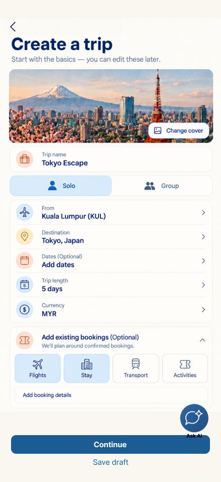</a>
<a href="assets/media/image6.png">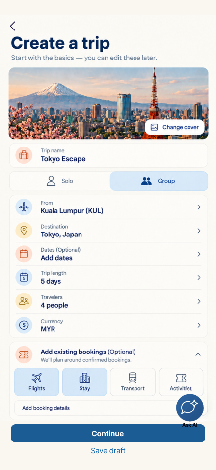</a>
<a href="assets/media/image7.png">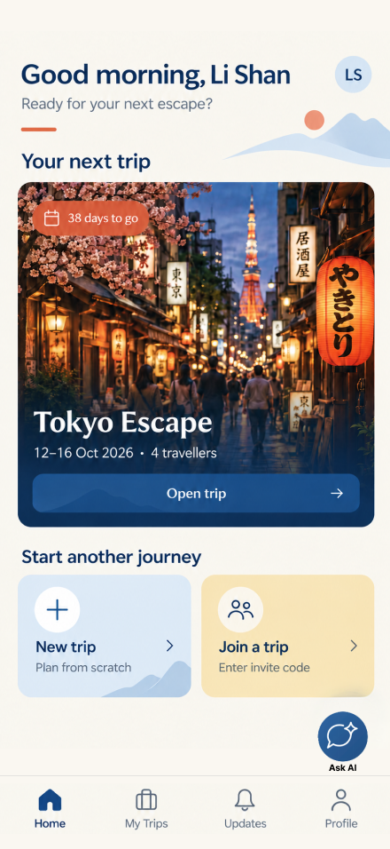</a>

**Manual trip creation**

From Home, users select New trip to enter their destination, departure city, travel dates or trip length, and currency. They can choose Solo or Group and set the number of travellers.

Users who have not decided on exact dates can enter the number of days first. They can also add existing bookings so the itinerary can be planned around arrangements they have already made.

**  
**

<a href="assets/media/image8.png">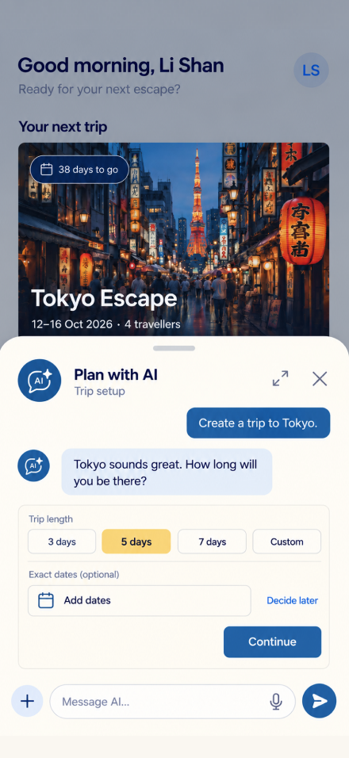</a>
<a href="assets/media/image9.png">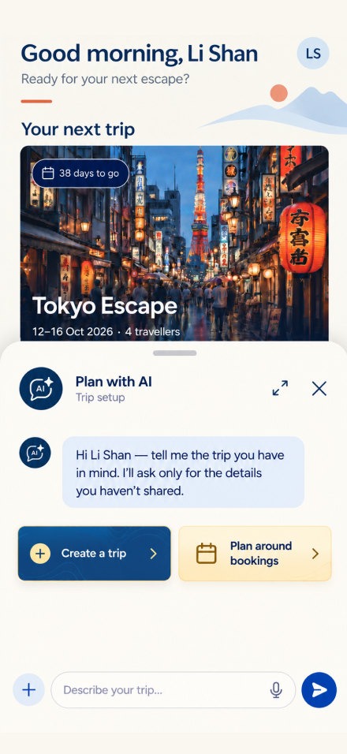</a>
<a href="assets/media/image10.png">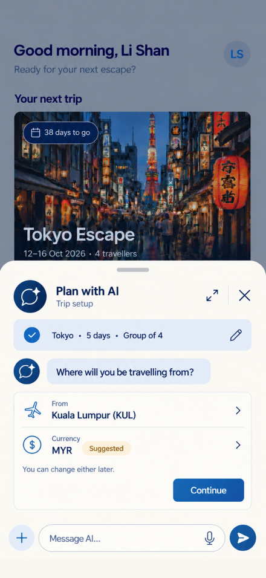</a>
<a href="assets/media/image11.png">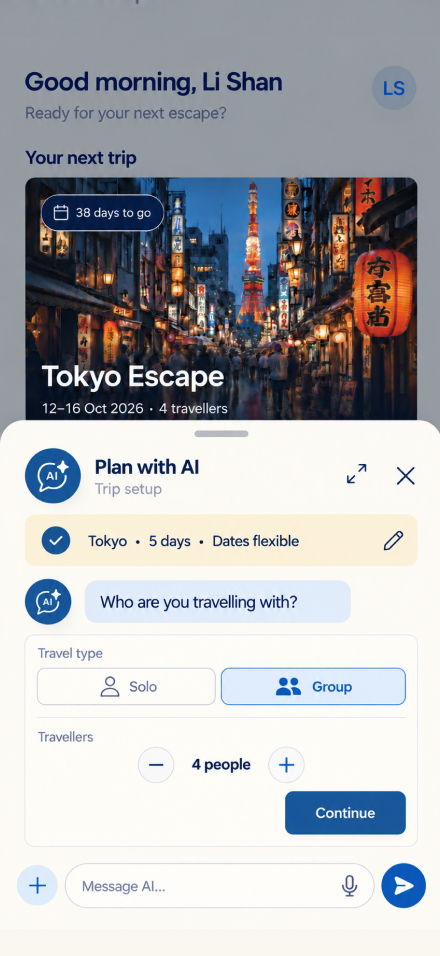</a>
<a href="assets/media/image12.png">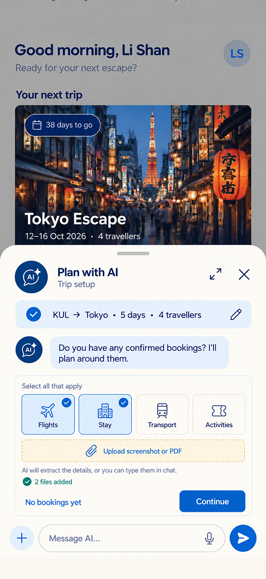</a>

**AI-assisted trip creation**

<a href="assets/media/image13.png">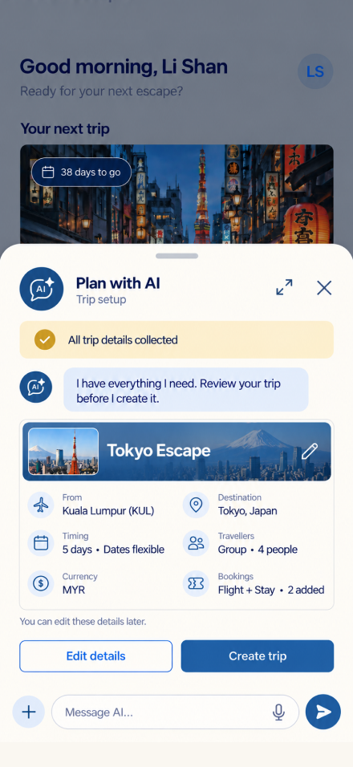</a>

Users can open the trip assistant and describe the trip they want. If information is missing, the assistant asks follow-up questions about the destination, trip length, departure city, travel type and existing bookings.

The assistant then presents a summary for review. Users can correct the details before selecting Create trip. This gives users a way to describe their plans in their own words while still checking the information used to create the trip.

<a href="assets/media/image14.png">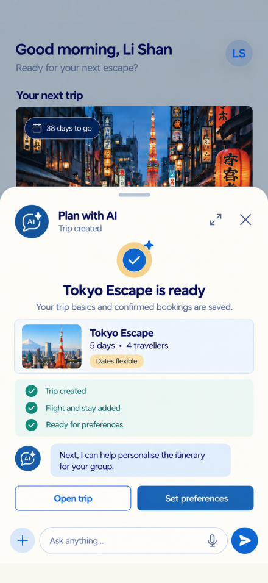</a>

**Creating a trip from a complete request**

<a href="assets/media/image15.png">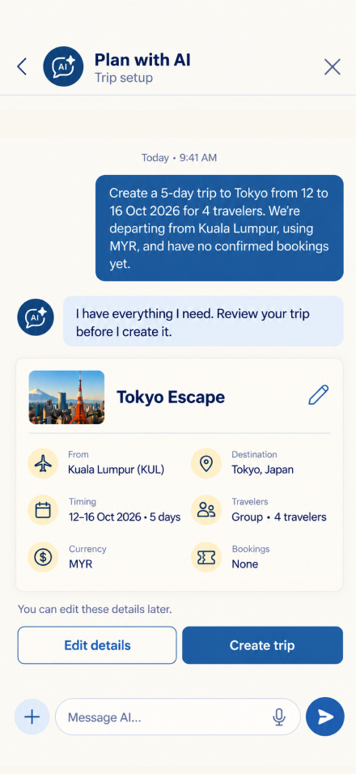</a>

Users can also provide the main trip details in one message. In the example shown, the assistant prepares a review card containing the destination, dates, departure city and number of travellers.

After checking and creating the trip, users can select Open trip or Set preferences.

**Inviting and joining group members**

<a href="assets/media/image16.png">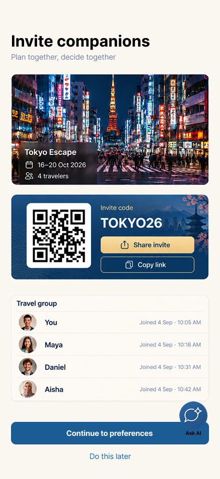</a>

For group trips, the organiser can share an invitation link or code. The invitation page shows the members who have joined and provides an entry to the preference setup. Solo travellers continue with their own preferences without inviting other members.

**  
**

#### 3.1.2 Setting Travel Preferences
NovaTrip collects preferences through four steps. These inputs help shape the itinerary around what travellers want to do, how they want to travel and any specific needs.

<a href="assets/media/image17.png">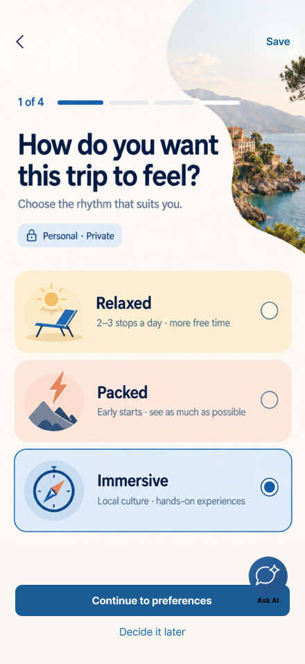</a>

**Step 1: How do you want this trip to feel?**

Users choose between Relaxed, Packed and Immersive. This sets the preferred travel pace, from leaving more free time to including more activities or spending longer exploring each place.

**Step 2: What matters most?**

<a href="assets/media/image18.png">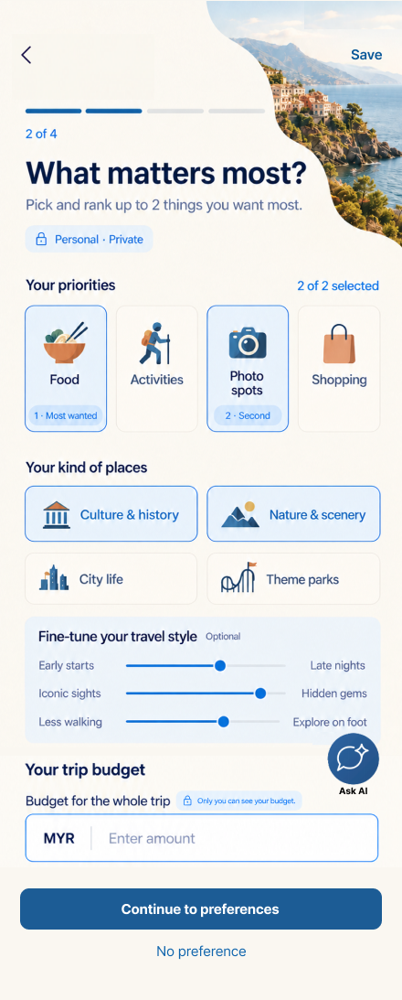</a>

Users select and rank up to two main interests, such as food, activities, photo spots or shopping. They can also choose the types of places they enjoy and adjust travel-style preferences.

These choices help distinguish between travellers who want different experiences from the same destination. Each traveller can enter a personal budget for the whole trip in the trip’s selected currency or select No preference to continue without setting a spending limit. The amount covers their own flights, accommodation, transport, food and activities, including existing booking costs.

Budget choices are private. For group trips, NovaTrip checks each member’s estimated costs against any budget they have provided. Choosing No preference does not change that member’s responsibility for shared expenses.

**  
**

<a href="assets/media/image19.png">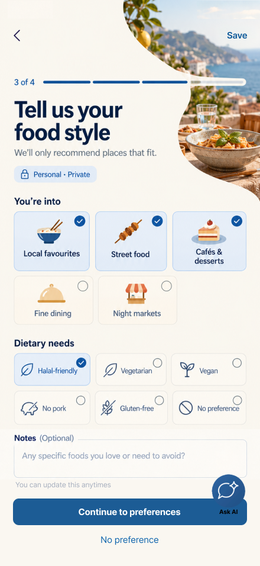</a>

**Step 3: Tell us your food style**

Users select food styles and dietary needs. The optional Notes field allows them to add specific requests or foods to avoid when the predefined choices are not enough. Users can also select No preference if they do not have a particular food preference.

Step 4: Add your must-dos

<a href="assets/media/image20.png">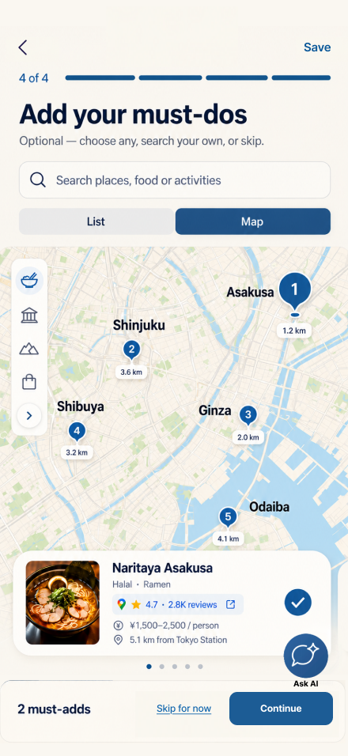</a>
<a href="assets/media/image21.png">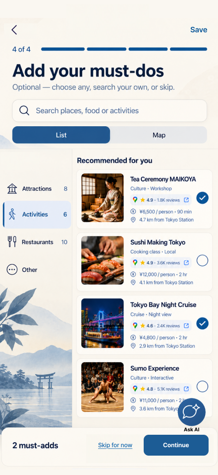</a>

Users can search for places or browse suggested attractions, activities, restaurants and other options. The List and Map views let them compare places using information such as ratings, prices and locations.

Users can select places they want included, remove a selection or skip this step if they have no must-do activities.

**Checking group readiness**

<a href="assets/media/image22.png">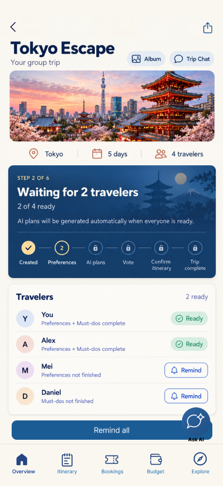</a>

For group trips, the Overview shows which members have completed their preferences and who is still pending. The organiser can send reminders without collecting and summarising everyone’s answers through a separate chat.

Plan generation begins once the required preferences are ready. Solo travellers only need to complete their own inputs.

**  
**

#### 3.1.3 Comparing and Choosing a Plan
<a href="assets/media/image23.png">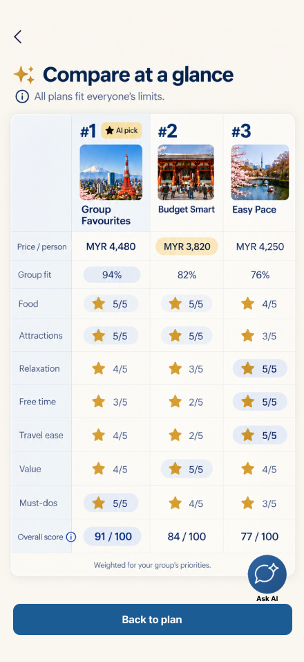</a>
<a href="assets/media/image24.png">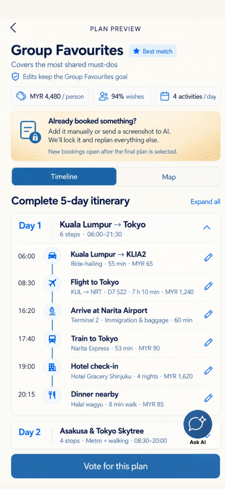</a>
<a href="assets/media/image25.png">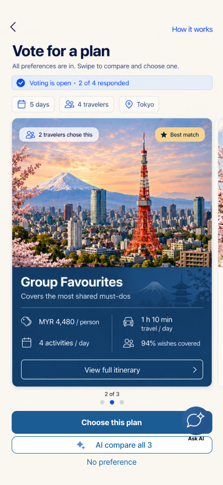</a>

NovaTrip generates three plans with different priorities, such as Group Favourites, Budget Smart and Easy Pace. Users can compare the options before deciding which plan suits their trip.

Users swipe between plan cards to review the main differences. Selecting “AI compare all 3 options” opens a comparison of costs, group fit and plan details. Users can review their estimated share of each plan’s costs. The planned generation process uses any personal budgets provided in Step 2.

Selecting View full itinerary opens the proposed schedule. Users can inspect the daily activities and switch between timeline and map views before making a choice.

Solo travellers can choose a plan directly. For group trips, members vote for a plan or select No preference. The plan cards show vote totals without displaying the names of the voters. The plan with the most votes is selected. If all members select No preference in the plan vote, NovaTrip selects the AI-recommended plan. If plans tie for the most votes, the tied plan with the highest AI score is selected. Voting closes after every member has selected a plan or No preference.

<a href="assets/media/image26.png">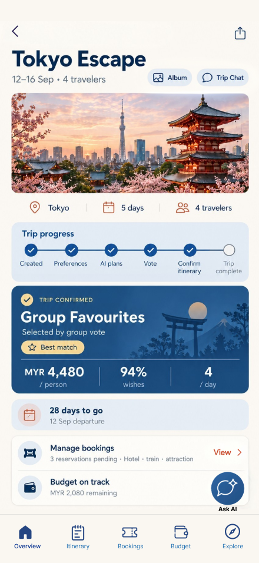</a>

Once a plan is selected, the Overview presents the chosen itinerary, trip progress and entries to bookings, budget, Trip Chat and Trip Album. This connects the planning stage with the tools users need to prepare for and follow the trip.

**  
**

#### 3.1.4 Following the Trip
<a href="assets/media/image27.png">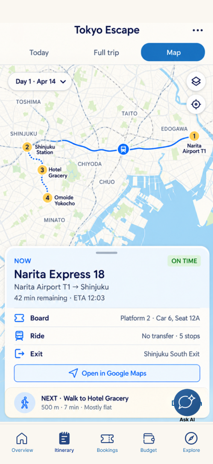</a>
<a href="assets/media/image28.png">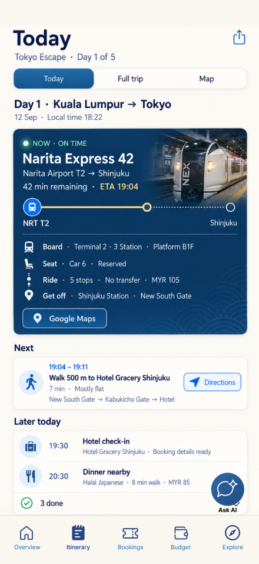</a>
<a href="assets/media/image29.png">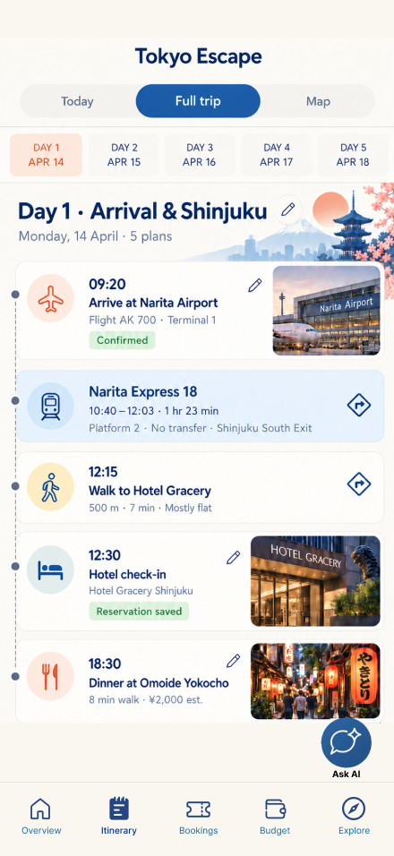</a>

NovaTrip provides Today, Full trip and Map views so users can follow the current activity or check the wider itinerary.

The Today view highlights the current activity and shows information such as its status, remaining time, arrival estimate and transport details. Upcoming activities appear under Next and Later today, helping users understand what comes next.

The Full trip view lets users select a day and review its activities, transport and saved booking details. The Map view shows the route and lets users browse activity cards alongside their locations.

Users can select Directions or Open in Google Maps when they need navigation. This keeps the itinerary as the starting point while allowing users to open detailed directions when needed.

**  
**

#### 3.1.5 Changing the Itinerary
Travellers may need to change their plans because of delays, long queues, closures or new preferences. NovaTrip provides itinerary edit controls and an AI-assisted route for reviewing possible changes.

<a href="assets/media/image30.png">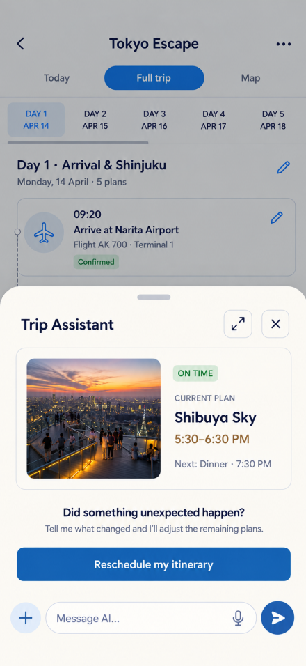</a>
<a href="assets/media/image31.png">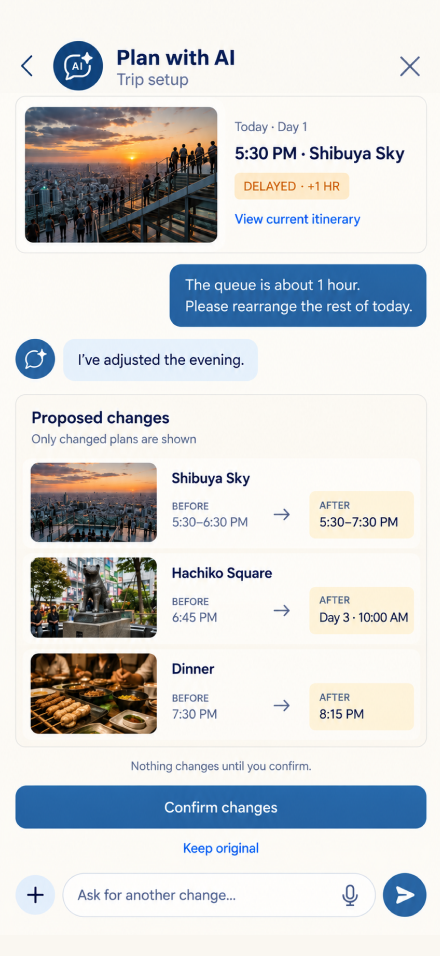</a>

**Requesting and reviewing an AI adjustment**

Users can open the trip assistant or select Reschedule my itinerary, then describe the situation through text or voice.

The assistant proposes changes to the remaining schedule while taking existing bookings into account. The Before/After comparison shows the affected activities and times so users can understand the proposal before accepting it.

Users can confirm the proposal, keep the original plan or ask for another change. The itinerary also includes edit controls for users who prefer to make changes manually.

**Confirming changes for a group**

<a href="assets/media/image32.png">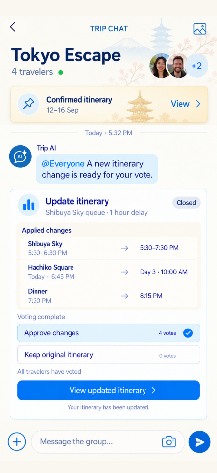</a>
<a href="assets/media/image33.png">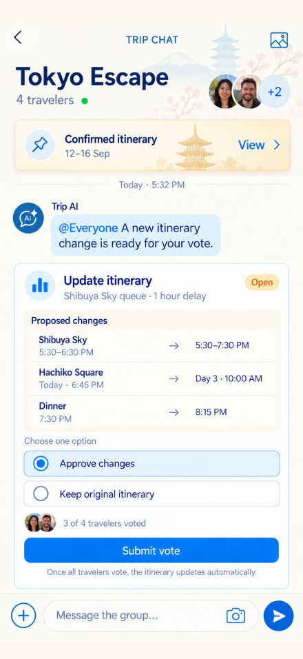</a>
<a href="assets/media/image34.png">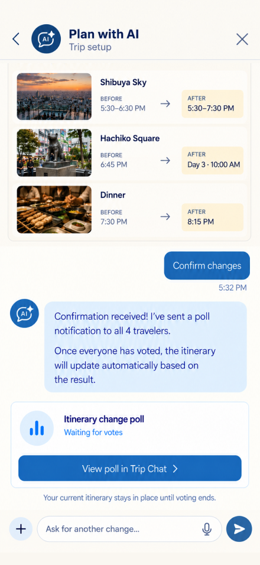</a>

In the group workflow, confirming the proposal creates an itinerary-change poll in Trip Chat. Members can choose Approve changes or Keep original itinerary.

The poll shows voting progress, and the current itinerary remains unchanged while voting is pending. After approval, the poll changes to Closed and provides a View updated itinerary entry. If the group chooses to keep the original itinerary, the proposed changes are not applied.

Solo travellers confirm their own changes without a group poll. Changes to the itinerary do not automatically change reservations made on external booking platforms.

**  
**

#### 3.1.6 Managing Bookings
NovaTrip supports travellers who already have bookings, those who want to book suggested options and those who want to find alternatives.

<a href="assets/media/image35.png">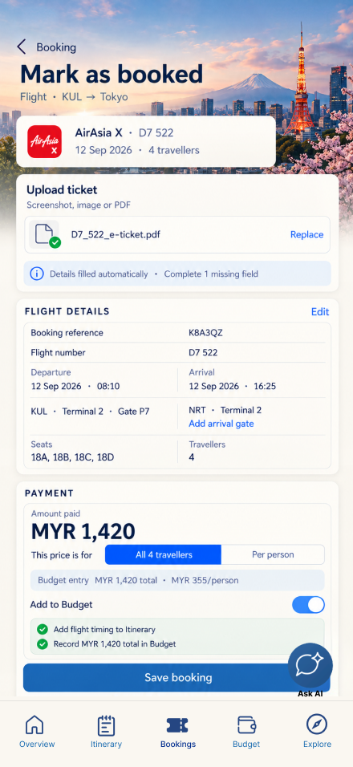</a>

**Adding existing bookings**

Users can add existing flights, accommodation, transport or activity bookings during trip setup. They can upload a screenshot or PDF or enter the details manually.

The upload flow fills in detected information for review. Users check the details, correct any errors and complete missing fields before saving. This allows existing arrangements to become part of the trip plan.

**Comparing and booking suggested options**

<a href="assets/media/image36.png">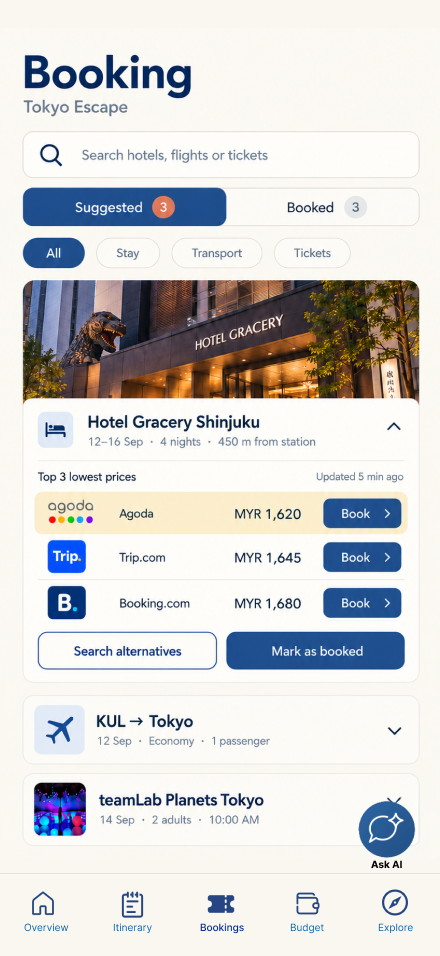</a>

The Suggested tab presents booking options related to the itinerary. Users can compare provider prices and select Book to open an external booking website.

After completing a booking, users return to NovaTrip and select Mark as booked to save the confirmation details. The Booked tab provides access to saved booking records.

**Searching for alternatives**

<a href="assets/media/image37.png">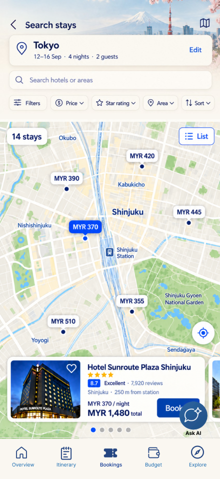</a>
<a href="assets/media/image38.png">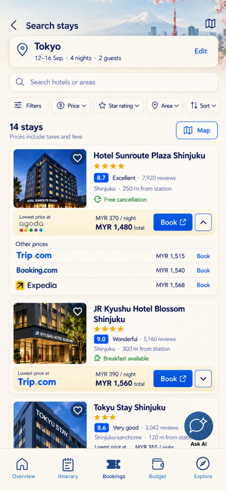</a>

If users do not want a suggested hotel, they can select Search alternatives. The search view supports filters such as price, star rating and area.

Users can browse results in a list or on a map, compare provider prices and open the chosen provider’s website.

When saving booking details, users can specify whether the recorded price covers all travellers or one person. They can also choose whether to add the cost to Budget, connecting the booking record with actual spending.

**  
**

#### 3.1.7 Tracking the Budget and Adding Expenses
NovaTrip separates planned costs from recorded spending through Trip Budget and Actual Expenses. Personal budgets entered in Step 2 are planning preferences. After a plan is selected, Trip Budget shows the estimated costs of that itinerary, while Actual Expenses records saved spending.

<a href="assets/media/image39.png">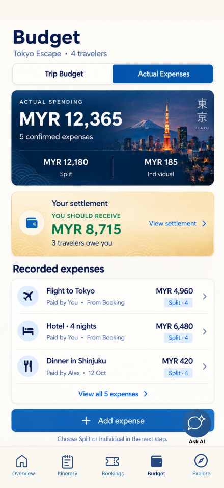</a>
<a href="assets/media/image40.png">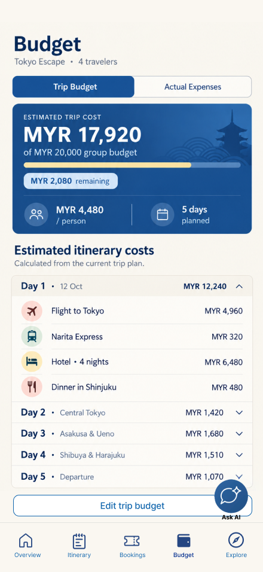</a>

**Reviewing estimated and actual costs**

The Trip Budget view shows the estimated trip cost, daily costs and the amount remaining against the budget. The Actual Expenses view shows recorded expenses, including booking costs added to Budget and expenses entered by users.

This helps travellers compare what they expect to spend with what they have recorded so far. Estimated itinerary costs are not counted as actual spending until the user saves an expense or chooses to add a booking cost to Budget.

**Adding an expense from the itinerary**

<a href="assets/media/image41.png">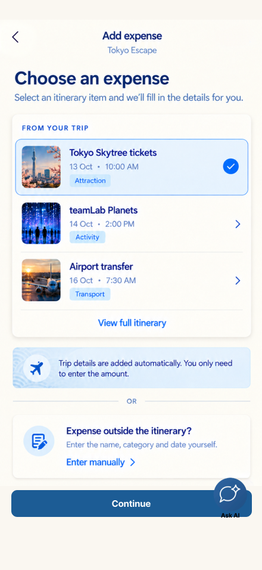</a>
<a href="assets/media/image42.png">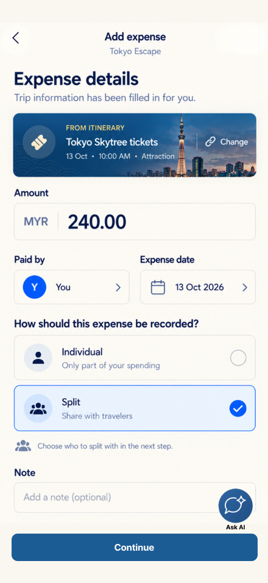</a>

Users select Add expense and choose an item from their itinerary. The selected activity provides the trip details, reducing the need to type them again.

Users then check the amount, payer and date, add an optional note, and choose whether the expense is individual or shared.

**  
**

<a href="assets/media/image43.png">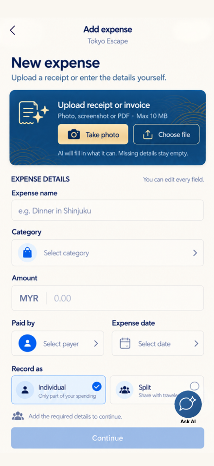</a>

**Adding an expense outside the itinerary**

For unplanned spending, users can create a new expense by entering its details or uploading a receipt through Take photo or Choose file.

Detected information can be reviewed and corrected before the expense is saved. This supports costs that were not included in the original itinerary.

**Choosing how to split the cost**

<a href="assets/media/image44.png">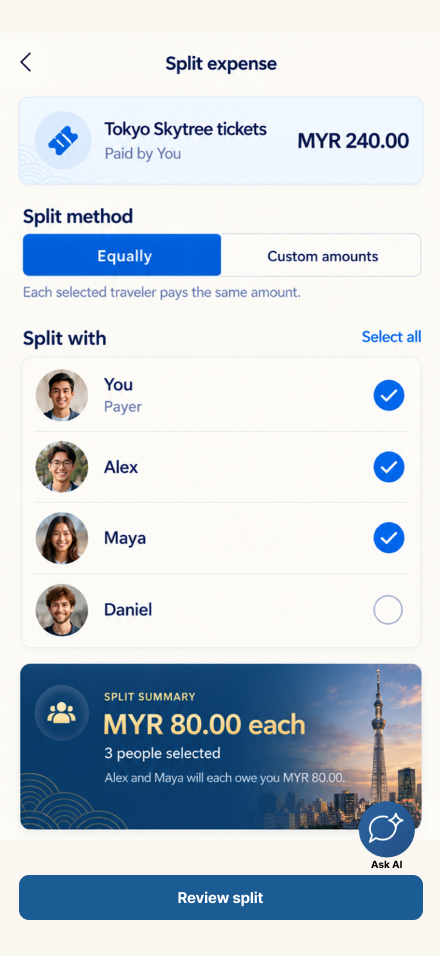</a>
<a href="assets/media/image45.png">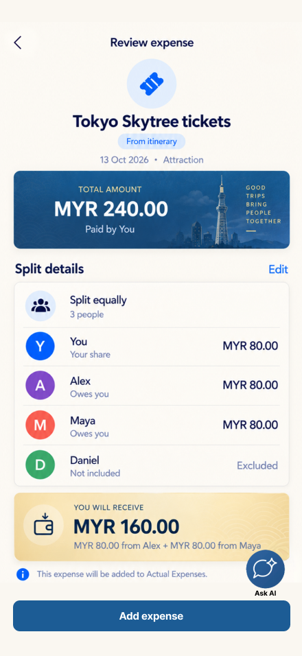</a>

For shared expenses, users select the members who participated and choose Equal or Custom amounts. Members who did not take part can be excluded.

The review page shows the amount, payer and each member’s share before the user selects Add expense. The saved expense updates actual spending and the relevant group balances. Individual expenses remain outside group settlement.

**  
**

#### 3.1.8 Checking and Settling Balances
The Settlement workflow helps group members understand who owes money, who should receive money and how each balance was calculated.

<a href="assets/media/image46.png">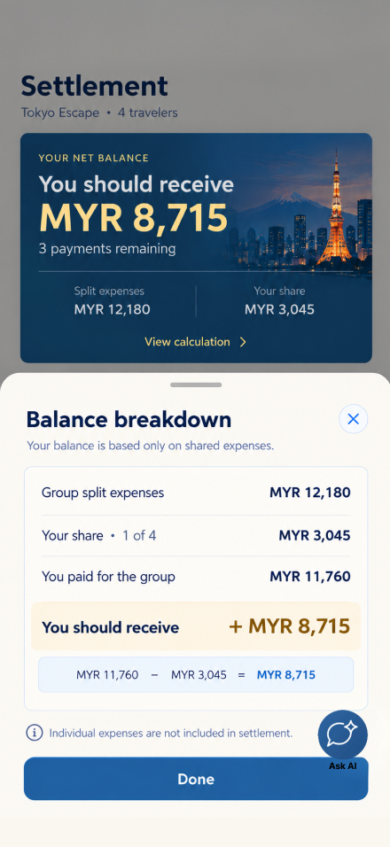</a>
<a href="assets/media/image47.png">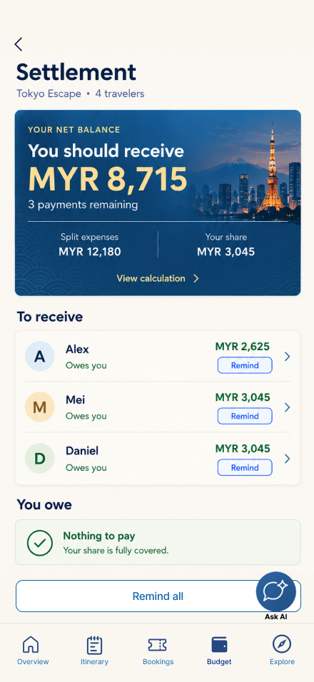</a>
<a href="assets/media/image48.png">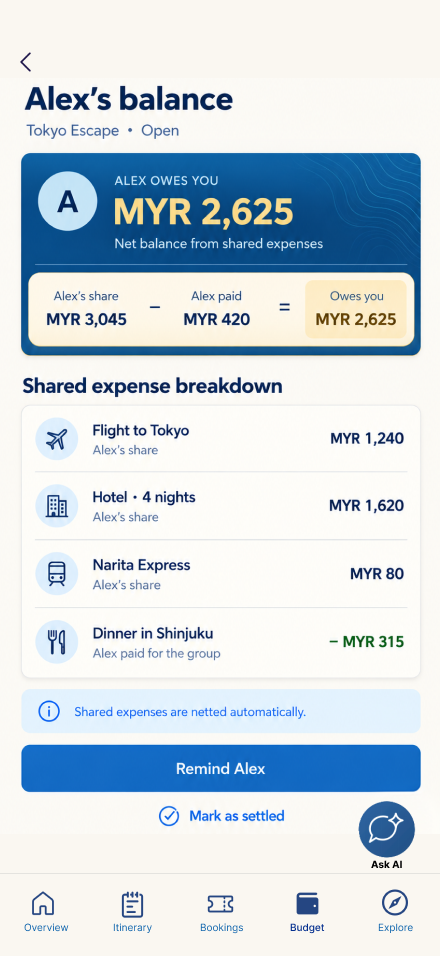</a>

The settlement summary separates To receive and You owe amounts. Users can select View calculation to compare their share of group expenses with the amount they have paid.

Opening a member’s balance shows the related expense breakdown. This helps users check the details behind a balance instead of relying only on a final total.

Users can send reminders and select Mark as settled after a payment has been completed. This records the settlement status; it does not transfer money. Solo travellers can review their own spending without using group settlement.

**  
**

#### 3.1.9 Communicating in Trip Chat

<a href="assets/media/image50.png">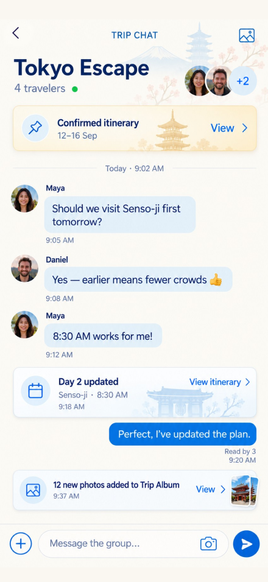</a>

Trip Chat gives group members a place to discuss the trip alongside itinerary updates, polls and shared photos.

Members can send messages and open the pinned itinerary from the conversation. System cards provide entries to information such as an updated day plan or newly added album photos.

Itinerary-change polls also appear in Trip Chat, allowing members to review and respond within the same conversation. The full change-confirmation process is shown in Section 3.1.5.

This reduces the need to create a separate travel discussion group and repeatedly copy updates between the itinerary and a messaging app.

**  
**

#### 3.1.10 Using Accessibility Settings
<a href="assets/media/image51.png">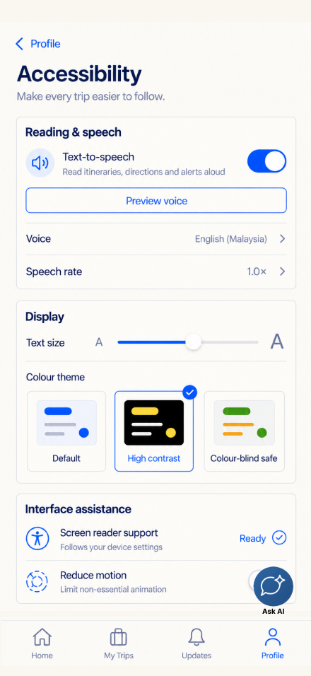</a>
<a href="assets/media/image52.png">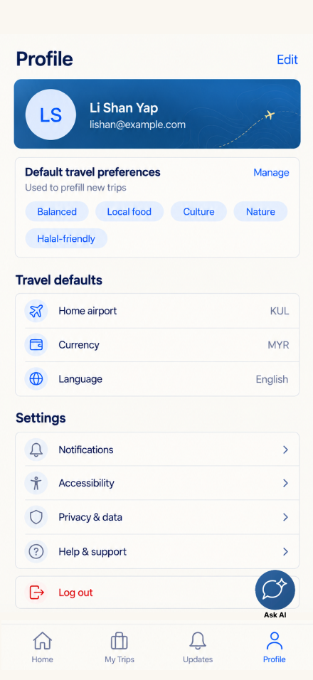</a>

NovaTrip includes accessibility settings so users can adjust how they read and interact with the app.

Users open Accessibility from Profile. The reading and speech controls include text-to-speech, a voice preview, voice language and speech rate.

Display controls allow users to adjust text size and choose between the default, high-contrast and colour-blind-safe themes. These options support different reading and colour-visibility needs.

The page also includes screen reader support information and a reduce-motion option. Together, these controls are intended to make trip information easier to access and follow.

**  
**

#### 3.1.11 Exploring Travel Ideas
Explore helps users find travel ideas when they are unsure what they want to do or want to discover additional options.

<a href="assets/media/image53.png">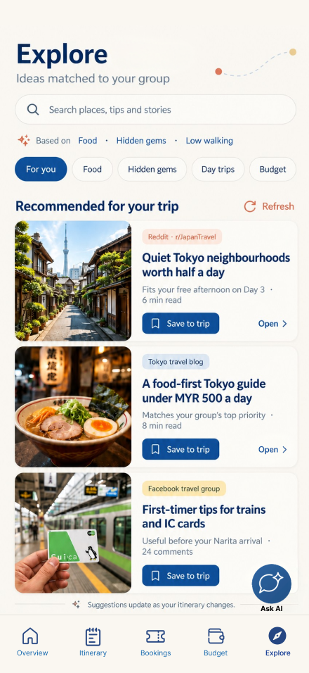</a>

Users can search for places, tips or stories and browse categories such as For you, Food, Hidden gems, Day trips and Budget.

Recommendation cards provide a preview, with Open and Save to trip actions. Users can browse ideas within NovaTrip instead of starting every search on a separate website.

Explore can be used while planning or during the trip. Saving an idea does not mean that it immediately replaces an activity in the confirmed itinerary, but it will be considered when the AI generates a plan.

**  
**

#### 3.1.12 Sharing Photos and Creating Postcards
Trip Album keeps travel photos together and offers different ways to browse, upload, download and share them.

<a href="assets/media/image54.png">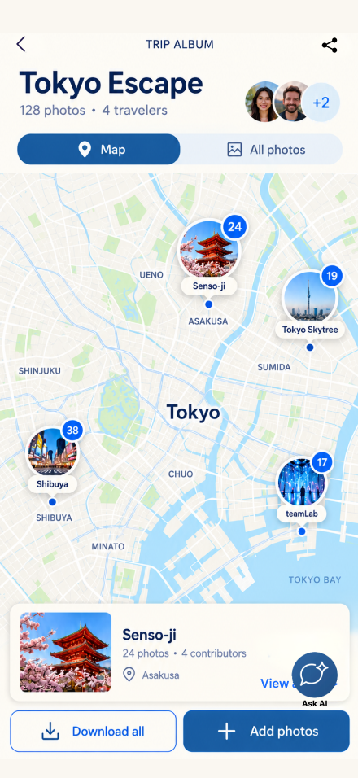</a>
<a href="assets/media/image55.png">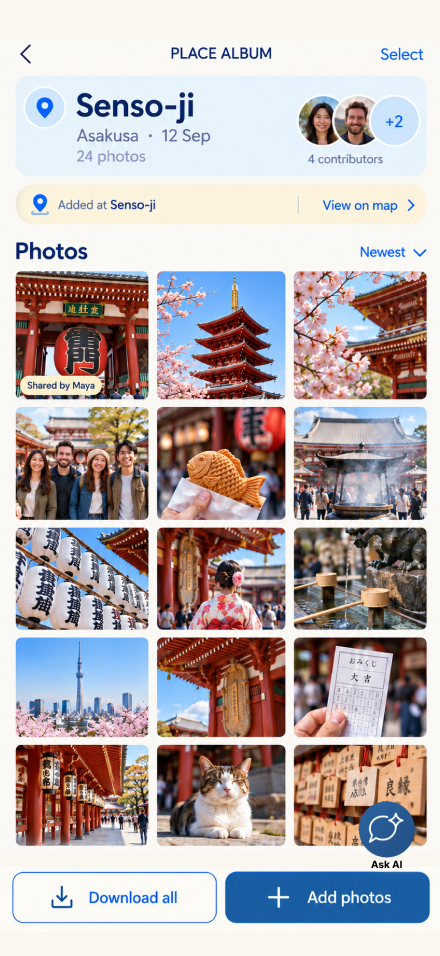</a>
<a href="assets/media/image56.png">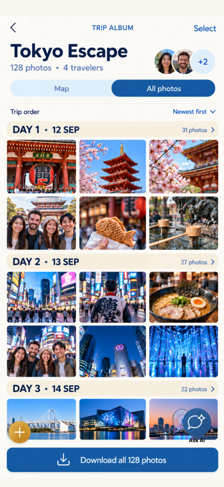</a>

**Browsing trip photos**

Users can switch between Map and All photos. The map groups photos around places, while the gallery presents photos by trip day.

Opening a place shows its photo collection and contributors. Users can download photos from the trip or a selected place, helping group members collect shared memories without creating a separate folder elsewhere.

**Adding and reviewing photos**

<a href="assets/media/image57.png">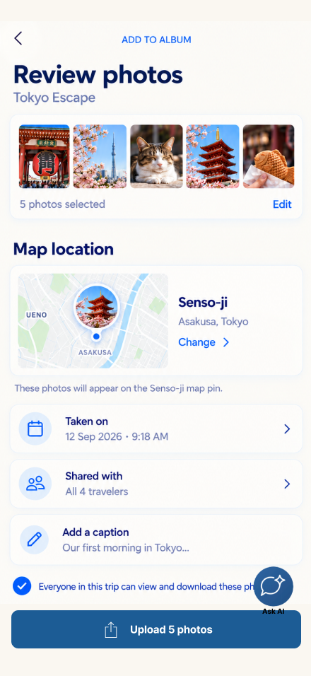</a>
<a href="assets/media/image58.png">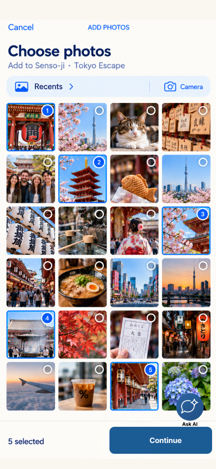</a>

Users select Add photos to choose images from their device or access the camera. Before uploading, they review the selected photos and check the suggested location.

They can change the location, review the date and sharing details, and add an optional caption. After upload, the photos become part of the trip album, and group members can see a photo update in Trip Chat.

**Creating a postcard**

<a href="assets/media/image59.png">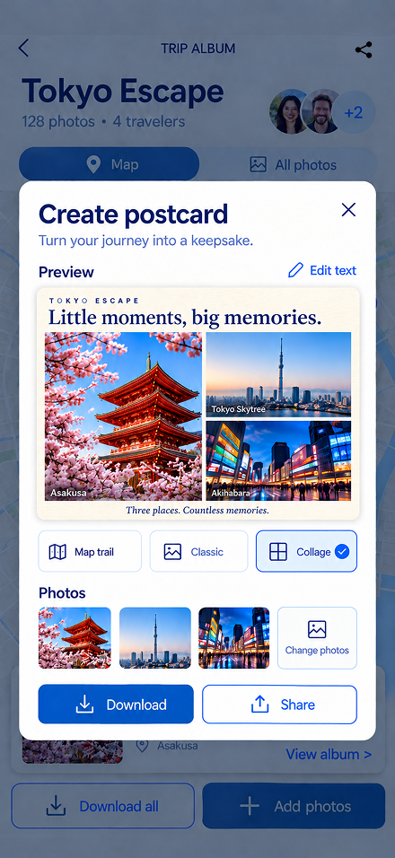</a>
<a href="assets/media/image60.png">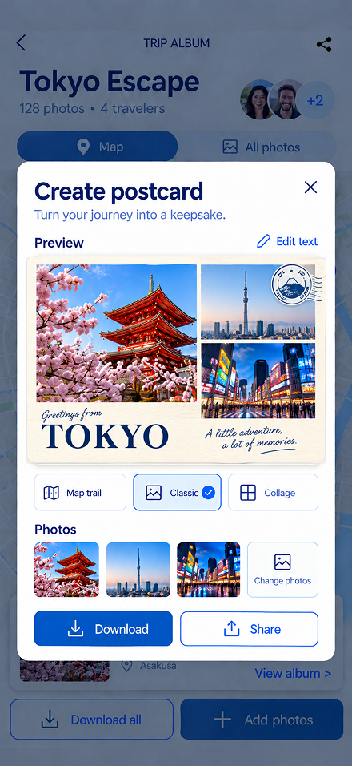</a>
<a href="assets/media/image61.png">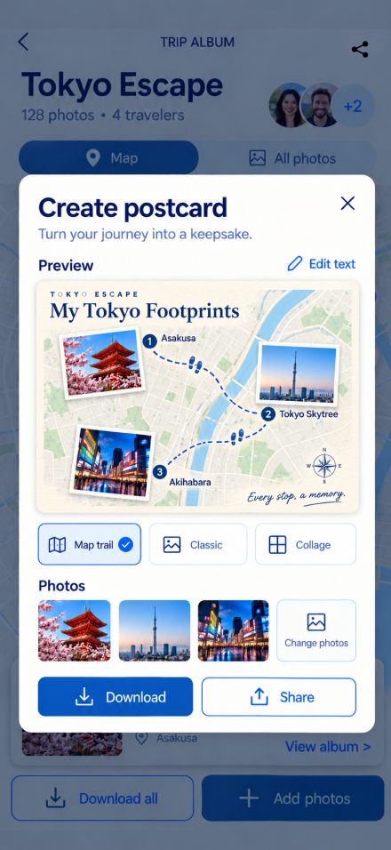</a>

Users can turn trip photos into a postcard using the Map trail, Classic or Collage style.

The preview provides controls to change photos and edit text before downloading or sharing the postcard. This extends the album from storing photos to creating a personal travel keepsake.

## 4. What Makes It Different

### 4.1 Novel Features & The Core Twist

**1. Guided Preference Profiling & Must-Do Curation**

- **What is Original / The Twist**: Traditional group planning begins with unstructured, messy messaging where individual preferences get drowned out. NovaTrip replaces endless debate with a guided 4-step profiling flow capturing pacing, travel priorities, food styles, and landmark "must-dos", paired with an optional food Notes field and a personal budget with a No preference option.This structures personal boundaries and niche interests into actionable constraints before a single schedule is drafted.

**2. AI 3-Blueprint Synthesis & Group Voting**

- **What is Original / The Twist**: Group decisions are typically hijacked by the most vocal travelers, leaving passive members disengaged. Instead of single-itinerary compromise, NovaTrip synthesizes group constraints into three distinct personas (*Group Favourite*, *Budget Smart*, and *Easy Pace*). By pairing an objective **"Compare at a glance"** matrix (contrasting cost, pace, and density) with anonymous blind voting, it neutralizes social pressure and delivers true group consensus. **Members can compare the plans before voting. Total votes are visible, but individual voters’ names are hidden. This gives quieter members a clear way to express their choice, although visible totals may still influence later votes.**

**3. Living Vertical Timeline & Live Cockpit**

- **What is Original / The Twist**: Conventional itineraries are static text documents that quickly fall out of sync once travel begins. NovaTrip's timeline functions as an operational live cockpit across Today, Full Trip, and Map viewports. The persistent "NOW" cockpit anchors on-the-move travelers with live transit status, platform and seat numbers, real-time arrival countdowns, and instant navigation links.

**4. Multi-Platform Booking Comparison & Smart Ticket Ingestion Hub**

> **What is Original / The Twist**: Addresses the data disconnect that happens when travelers leave an app to book on external OTAs. Beyond comparing live rates across Agoda, Trip.com, and Booking.com, the **"Mark as booked"** workflow uses smart ticket scanning to process reservation PDFs and screenshots, automatically extracting booking references, departure times, and costs. **Users can review and verify the extracted information before confirming the booking. They can then choose whether to add the booking cost to the shared Budget, while the confirmed booking details are added to the itinerary.**

**5. Dynamic Replanning & Event-Driven Workspace**

- **What is Original / The Twist**: Traditional trip plans collapse as soon as a delay or closure occurs, forcing frantic manual recalculations in separate messaging apps. NovaTrip connects timeline disruption recovery directly to group decision-making: travelers trigger **"Reschedule my itinerary"** from the Trip Assistant, and the AI calculates the resulting changes to the itinerary. **The AI proposes changes to the remaining itinerary and shows a Before/After comparison. After the user confirms the proposal, a poll is created in Trip Chat. The shared itinerary is updated only after the proposed change is approved.**

**6. Stop-Linked Ledger & Smart Net Debt Settlement**

- **What is Original / The Twist**: Decoupled split-bill apps force redundant data entry and result in awkward post-trip debt collection. NovaTrip anchors expenses directly to confirmed itinerary stops and computes real-time net balances across the whole group. Travelers can inspect individual peer balance breakdowns, send gentle "Remind" payment nudges, and execute one-tap "Mark as settled" to record payments made outside the app.

**7. Interactive Footprint Scrapbook & Keepsake Postcards**

- **What is Original / The Twist**: Replaces buried phone photo dumps and chaotic album links with a contextual footprint gallery organized by geographic coordinates and travel days. Beyond chronological and map pin browsing, NovaTrip features a built-in keepsake postcard generator, allowing groups to transform collective photos into stylized keepsakes (Map-trail, Classic, or Collage) ready for instant sharing and export.

### 4.2 Competitive Differentiation Matrix

| Capability / Feature Dimension                                                        | NovaTrip — Proposed Design                                                                                                                   | Wanderlog                                                                                                                                                               | TripIt / TripIt Pro                                                                                                                                                   | Sygic Travel / Sygic                                                                                                                           |
|---------------------------------------------------------------------------------------|----------------------------------------------------------------------------------------------------------------------------------------------|-------------------------------------------------------------------------------------------------------------------------------------------------------------------------|-----------------------------------------------------------------------------------------------------------------------------------------------------------------------|------------------------------------------------------------------------------------------------------------------------------------------------|
| Guided Preference Profiling & Must-Dos *(Structured pacing, priorities & open notes)* | **Yes** — 4-step guided profiling with travel priorities, custom notes and landmark must-dos                                                 | **Not confirmed in reviewed sources** — personalization and AI suggestions are available, but the specific structured group profiling flow was not confirmed            | **Not confirmed in reviewed sources** — supports adding plans, notes and photos, but no equivalent structured group preference intake was confirmed                   | **Not confirmed in reviewed sources** — POI and route-based planning are documented, but no equivalent preference profiling was confirmed      |
| AI Consensus Synthesis *(Multi-blueprint synthesis & blind voting)*                   | **Yes** — generates 3 blueprints (*Group Favourite, Budget Smart, Easy Pace*) with group voting                                              | **Partial** — provides an AI Assistant for itinerary planning and real-time collaboration, but the reviewed sources do not confirm multi-blueprint group voting         | **Not confirmed in reviewed sources** — itinerary organization and sharing are supported, but no equivalent AI consensus workflow was confirmed                       | **Not confirmed in reviewed sources** — route planning and optimization are documented, but no collaborative AI voting workflow was confirmed  |
| Dynamic Rescheduling Engine *(In-trip adaptive replanning with review)*               | **Yes** — Trip Assistant proposes changes, shows Before/After comparison, then creates a Trip Chat poll before updating the shared itinerary | **Partial** — provides AI assistance and route optimization, but the specific disruption → proposal → group poll → approved itinerary update workflow was not confirmed | **Partial** — TripIt Pro provides flight alerts and alternate-flight options, but the reviewed sources do not confirm ground-itinerary replanning with group approval | **Partial** — supports route optimization and route recalculation, but the reviewed sources do not confirm collaborative trip-level replanning |
| Timeline-Linked Expense Tracking *(Stop-anchored presets & split management)*         | **Yes** — expenses can be linked to itinerary stops with custom splitting and settlement tracking                                            | **Yes** — supports travel expense tracking, budgeting and splitting costs with tripmates                                                                                | **Not confirmed in reviewed sources** — the reviewed TripIt sources focus on itinerary, travel information and documents rather than group expense splitting          | **Not confirmed in reviewed sources** — no equivalent expense tracking feature was confirmed                                                   |
| Event-Driven Workspace Chat *(Interactive system updates in message thread)*          | **Yes** — Trip Chat can contain itinerary-change polls, schedule updates and collaborative trip content                                      | **Partial** — supports real-time collaboration and live syncing, but an integrated chat workspace with system-generated voting/update cards was not confirmed           | **Partial** — supports sharing trip information and updates through external messaging apps, but a dedicated in-app group chat was not confirmed                      | **Not confirmed in reviewed sources**                                                                                                          |
| Collaborative Footprint Scrapbook *(Map-pinned & chronological photo capture)*        | **Yes** — photos are linked to trip stops and organized into map/day-based memories with postcard creation                                   | **Partial** — supports trip images, attachments and collaborative trip planning, but the specific map-pinned scrapbook/postcard workflow was not confirmed              | **Partial** — supports adding photos and documents to trips, but the reviewed sources do not confirm a collaborative map-based scrapbook                              | **Not confirmed in reviewed sources**                                                                                                          |
| Full Lifecycle Coverage *(Consensus planning, live adaptation, shared memories)*      | **Yes** — combines group preference capture, consensus planning, live replanning, expenses, communication and shared memories                | **Partial** — covers itinerary planning, collaboration, reservations, budgeting, AI assistance and route optimization                                                   | **Partial** — strong coverage of itinerary organization, sharing, documents and flight/travel alerts                                                                  | **Partial** — strong focus on navigation, offline maps, route planning and route optimization                                                  |

NovaTrip’s main design focus is the connection between these steps: collecting preferences, comparing three plans, reviewing changes around existing bookings, and approving shared updates through Trip Chat.

### 4.3 Reach & Scalability

- **Growth Through Group Invitations:** Every shared itinerary becomes an organic acquisition loop. Organizers invite 3–6 companions to create private profiles, vote on trip plans, and track shared expenses. These participants can later become trip organizers and invite their own groups.

- **Public Footprint Artifacts & Social Distribution**: Completed itineraries and geo-tagged memories become shareable travel recaps and map stories. Sharing them on platforms like Instagram, Xiaohongshu, and TikTok **could help other travellers discover NovaTrip**.

- **Horizontal Expansion Beyond Leisure Travel**: While designed for friend groups and solo travelers, NovaTrip’s core features—private preference synthesis, dynamic rescheduling, and automated expense splitting—can also support university trips, student society retreats, and corporate team-building with further work on permissions, larger groups and administration.

## 5. Technical Architecture & Feasibility

### 5.1 Tech Stack Justification & Engineering Constraints

**Frontend: Flutter (Dart)**

- **Why Chosen**: Flutter allows us to build the Android app on Windows while keeping a consistent interface across the main workflows. We selected Android as the first target because it fits our available development resources. Flutter also leaves the option to support iOS later, subject to platform-specific testing and access to the required Apple tools.

- **Constraints & Mitigations**: Map rendering, live trip updates, and large itinerary data may increase memory usage on lower-end devices. This will be mitigated through lazy-loading of map content, efficient state management, and background isolates for heavier JSON parsing where necessary.

**Backend: Node.js (Express & TypeScript)**

- **Why Chosen**: Node.js provides lightweight, asynchronous request handling that is well suited for the application's API requests, itinerary updates, group voting, budget management, and communication with external services. Express simplifies REST API development, while TypeScript provides strong typing and consistent data structures across the application.

- **Constraints & Mitigations**: Node.js uses a single event loop, so CPU-intensive operations may affect responsiveness. The MVP will minimise heavy backend processing by performing OCR on the client side using on-device Google ML Kit Text Recognition and keeping backend operations focused on lightweight business logic, validation, and database transactions.

**Database: Managed PostgreSQL (Cloud-Hosted via Supabase)**

- **Why Chosen:** PostgreSQL provides reliable relational data management and ACID transactions, making it suitable for structured data such as trips, itineraries, expenses, voting records, and user preferences. NovaTrip uses a cloud-managed PostgreSQL instance through **Supabase**, avoiding local database dependencies and allowing the deployed backend to access the same database during development and testing.

- **Constraints & Mitigations:** Managed free tiers may impose connection limits, quotas, or cold starts. Connection pooling will therefore be used through the PostgreSQL driver or a managed pooler such as **PgBouncer**. Automated schema migrations will ensure that the database schema can be reproduced consistently across environments.

**APIs & External Services**

- **LLM Engine: Google Gemini API**: Gemini is used for itinerary generation, 3-blueprint synthesis, and dynamic rescheduling. It produces structured JSON responses, which are checked using **Zod** runtime schema validation before being stored in the database. This helps prevent malformed AI responses and inconsistent data. A heuristic fallback will be used for essential itinerary logic if an AI request fails or reaches the available API quota.

- **Geospatial & Navigation: Google Maps Platform / Mapbox:** A single mapping provider will be selected based on the required map, routing, place, and ETA capabilities. For the competition prototype, representative transit and accommodation data may be seeded or simulated where live third-party data is not available. Client-side caching and limiting unnecessary API requests will reduce latency and help keep usage within available free quotas.

### 5.2 System Architecture Diagram 

<a href="assets/media/image62.png">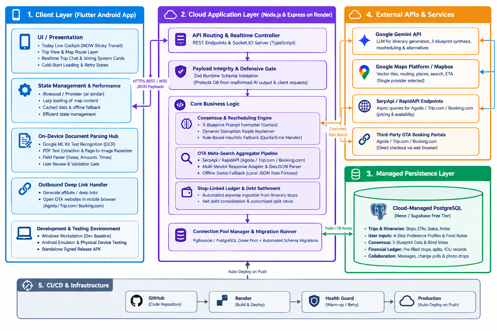</a>

### 5.3 Build Plan, Scope Realism & Resource Awareness

To ensure high engineering feasibility within the competition timeframe, NovaTrip follows a clearly defined build strategy. Instead of trying to build a full travel super-app, the building phase focuses on validating our core value loop: **can guided preference profiling and dynamic in-trip rescheduling reduce coordination friction?**

**In-Scope (What We Will Build During the Building Phase)**

- **Guided Preference Profiling & Must-Do Baseline:** A streamlined 4-step onboarding flow capturing pacing, priorities, food style, custom notes, and landmark must-dos.

- **AI Consensus Synthesis Engine**: A backend pipeline that combines private group preferences using LLM structured outputs to generate three balanced blueprints (*Group Favourite*, *Budget Smart*, *Easy Pace*), together with an anonymous blind-voting interface.

- **Live Cockpit & Dynamic Rescheduling**: An interactive **Today** timeline with a sticky **NOW** indicator and a one-tap disruption simulation (+45 min delay). The system then displays an interactive **Before/After** schedule card for review.

- **Event-Driven Workspace Chat:** A real-time chat powered by the Node.js backend and Socket.IO, with interactive system cards such as live polls and schedule changes displayed directly within the conversation.

- **Stop-Linked Expense Split Prototype**: A manual expense ledger that pre-fills expenses from booked itinerary stops and supports simple IOU settlement.

- **Collaborative Footprint Scrapbook**: A functional prototype that allows trip members to upload photos and link them directly to completed itinerary stops. Album photos will be stored in persistent object storage, while PostgreSQL stores file references, locations and trip membership details. The demo will use compressed images and limited uploads, with access restricted to the relevant trip members.

- **Multi-Platform OTA Comparison Engine**: A meta-search aggregation service within Node.js that cross-references accommodation rates across Agoda, Trip.com, and Booking.com. It powers both the interactive map viewport pins and sortable list views with direct provider deep links.

**Out-of-Scope (Deferred to Post-Competition Roadmap)**

- **Direct Payment Gateways**: No live credit card processing, Stripe/PayPal checkout, or in-app money transfers. Balances are tracked through a shared ledger instead of actual banking transactions.

- **Native OTA Checkout Integration**: No direct two-way booking API integrations with Expedia, Booking.com, or Agoda. NovaTrip will provide deep links and structured receipt parsing, while checkout remains on the third-party platform.

- **Complex User & Role Permission Hierarchies**: No multi-level permission system such as separate read/write/admin roles for individual stops. All invited trip members have equal operational and voting rights. These shared-trip permissions do not grant access to other members’ private budget choices. Each member can view and edit only their own budget information.

- **Full Multi-Language Internationalization (i18n)**: The UI and AI prompts will use English only for demo consistency. Multi-language support will be added in future versions.

- **iOS Release:** The competition build will target Android. iOS builds and distribution are deferred until the team has access to the required development tools and testing resources.

**Milestone Timeline (Build Phase)**

**Week 1: Core Foundation & AI Blueprint Synthesis (21 Sep – 27 Sep)**

- **Objective:** Establish the full-stack pipeline and complete the pre-trip planning loop end-to-end.

- Set up the cloud-managed PostgreSQL database schema on Supabase for core entities including Trips, Stops, Ledgers, and Preferences.

- Build Node.js API endpoints with TypeScript and Zod schema validation; integrate the Gemini API for structured 3-blueprint generation.

- Scaffold the Flutter client navigation for **Today, Full Trip, Map, and Chat**, and connect the Guided Preference Profiling flow with blueprint rendering and blind-voting cards.

- **Milestone:** A user can create a trip, submit trip preferences, generate multiple AI itinerary blueprints, and complete the initial group voting flow.

**Week 2: Realtime Workspace & Dynamic Execution Engine (28 Sep – 4 Oct)**

- **Objective:** Deliver in-trip live adaptation and collaborative workspace features.

- Build the Dynamic Rescheduling Copilot with a **Before/After** staging buffer and interactive timeline-diff cards for reviewing proposed changes before confirmation.

- Implement the **Mark as Booked** flow using Google ML Kit OCR to extract reservation information from uploaded tickets or images and pre-populate booking details.

- Implement realtime communication and state synchronisation for in-app chat, voting results, and trip updates using the Node.js backend and Socket.IO.

- Implement the stop-linked expense ledger with automatic split calculation and persistent PostgreSQL storage.

- Implement the **Multi-Platform Price Comparison pipeline** by fetching and aggregating normalized hotel rates across Agoda, Trip.com, and Booking.com, rendering price overlays across map markers and comparison lists with outward deep links.

- **Milestone:** A group can collaboratively update an active trip, receive AI-assisted rescheduling suggestions, record bookings, and synchronise shared expenses.

**Week 3: System Integration, Stress Testing & Code Freeze (5 Oct – 11 Oct)**

- **Objective:** No new major features; focus entirely on integration, reliability, usability, and final deliverable preparation.

- **End-to-End Integration:** Test deterministic 3-person scenarios, including a 4-day Tokyo trip with different budget constraints, across the complete planning-to-execution workflow.

- **Resilience & Demo Hardening:** Pre-cache representative AI responses, itinerary data, and map information where appropriate, while implementing graceful fallbacks for API failures or unstable network conditions.

- **Performance & Error Testing:** Test API failures, invalid AI responses, OCR inaccuracies, database errors, and incomplete user inputs. Validate AI-generated outputs using Zod before committing changes.

- **UI & Device Testing:** Test the Android app on the selected emulator and available physical devices. Check different screen sizes, system back navigation, keyboard behaviour, permissions, photo uploads and accessibility settings.

- **Code Freeze & Final Sign-off:** Freeze the codebase on **9 October**, leaving the remaining build phase for final verification, documentation checks, and demo preparation before the official Deployment Phase on **12 October**.

- **Milestone:** Stable end-to-end MVP with tested core workflows, fallback mechanisms, and a frozen release candidate ready for deployment and judging.

**Resource Awareness & Budget Discipline**

- **Infrastructure Cost Target:** We aim to keep hosting costs within the selected services’ free allowances during the competition. Usage, storage and service limits will be checked during development. Free tiers do not guarantee continuous availability. Any costs for iOS distribution, additional storage or paid API access will be recorded separately.

<!-- -->

- **AI API Cost Control:** Gemini will be used as the primary LLM. Development and testing will minimise unnecessary API calls through reusable test prompts, deterministic test scenarios, and cached representative responses. A maximum budget of **RM25** will be allocated for LLM API usage during development and final validation.

- **Map API Cost Control:** Only one mapping provider will be used. API requests will be limited to essential map, route, ETA, and place-data operations, with client-side caching used to reduce repeated requests and keep usage within the provider's available free quota.

- **Open-Source Cost Reduction:** Google ML Kit, Flutter, Node.js, TypeScript, PostgreSQL, Express, and Zod are open-source or freely available development technologies, allowing the core application stack to be developed without software licensing costs.

- **Live Demo Contingency:** Representative AI outputs, itinerary data, and map results will be prepared in advance as fallback data. This ensures that the core user journey can still be demonstrated if external APIs experience temporary failures or unstable venue Wi-Fi.

<!-- -->

- **OTA Aggregation Cost Control**: Accommodation comparison uses the available **free tiers of meta-search APIs (e.g., SerpApi / RapidAPI)** to fetch live rates from multiple platforms. Locally cached rate fixtures are also used for core demo locations to avoid unexpected network delays at the venue. Real-time outbound actions use zero-cost deep linking. This results in **RM0 spent on enterprise affiliate partnerships or paid API subscriptions**.

<!-- -->

- **Estimated Build-Phase Cost:** **RM0–RM25**, assuming Gemini and the selected map provider remain within their available free usage limits. No cloud hosting subscription is required for the competition MVP.

**5.4 Future Enhancements & Scalability Roadmap**

Following the validation of NovaTrip's core planning-to-execution loop during the MVP phase, the architecture can be extended in the following areas:

**Location-Based Social Discovery ("Travel Buddies"):**

- NovaTrip will introduce an opt-in feature that allows both solo and group travelers to discover other NovaTrip users at the same attractions or landmarks. Using geohash-based spatial indexing with PostGIS and low-power geofencing, users can discover nearby travelers interested in shared activities or transit. Precise GPS coordinates will not be exposed; users will instead be represented at the landmark level. Any interaction will require mutual opt-in before a temporary activity chat is created.

**Group Safety Monitoring & SOS:**

- NovaTrip will introduce an opt-in group safety feature that monitors members' approximate locations and activity status during an active trip. If a member remains unusually far from the group with no significant movement for a defined period, such as one hour, NovaTrip will send a **safety alert** to the other members. They can check the member's last known location and attempt to contact them. If the member cannot be reached, an authorized group member can trigger a **one-tap emergency call** to the relevant local emergency service.

## Additional Prototype Screens

### 1

<a href="assets/additional/1.png">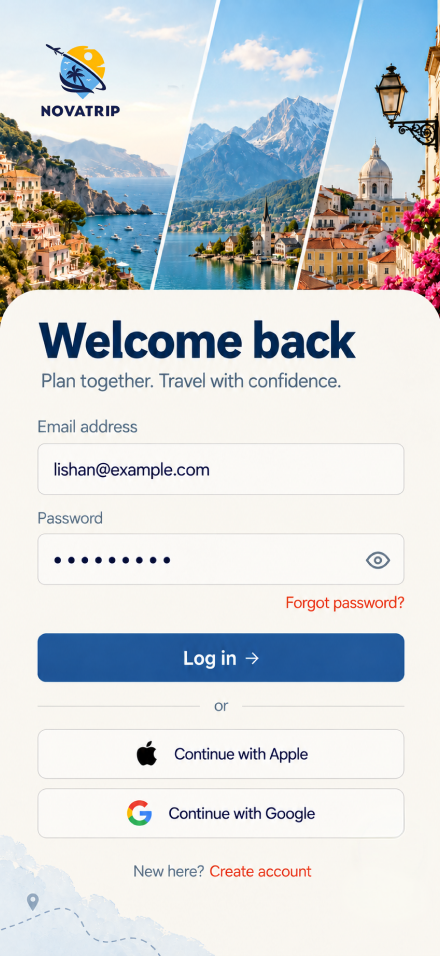</a>

### ChatGPT Image Sep 12, 2026, 02_42_33 PM

<a href="assets/additional/chatgpt-image-sep-12-2026-02-42-33-pm.png">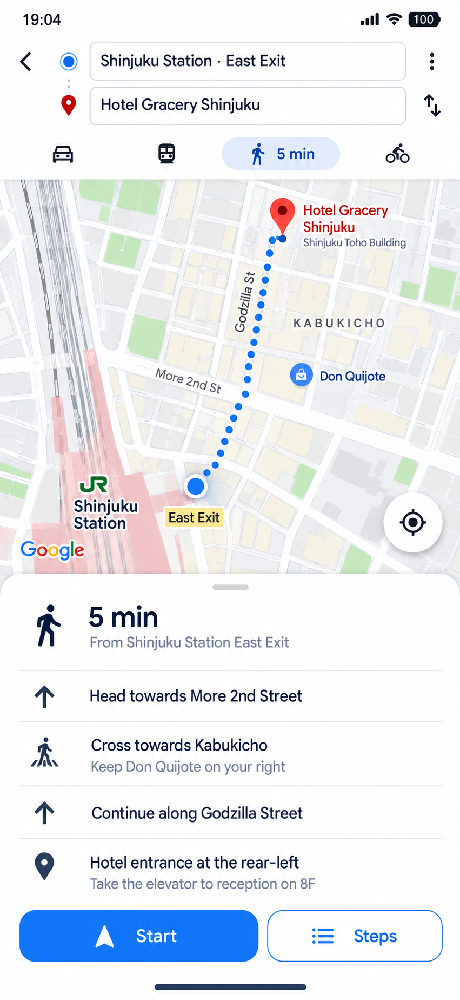</a>

### ChatGPT Image Sep 12, 2026, 03_11_23 PM

<a href="assets/additional/chatgpt-image-sep-12-2026-03-11-23-pm.png">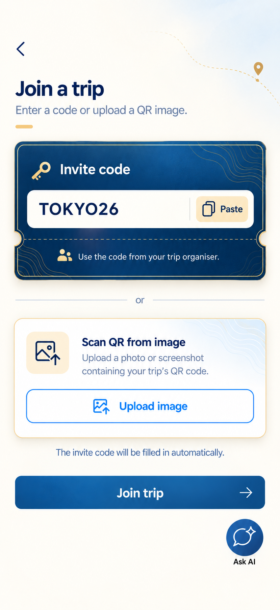</a>

### Frame 11

<a href="assets/additional/frame-11.png">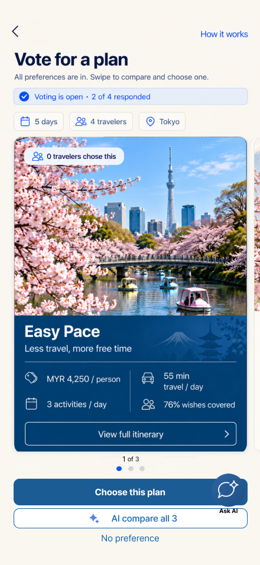</a>

### Frame 12

<a href="assets/additional/frame-12.png">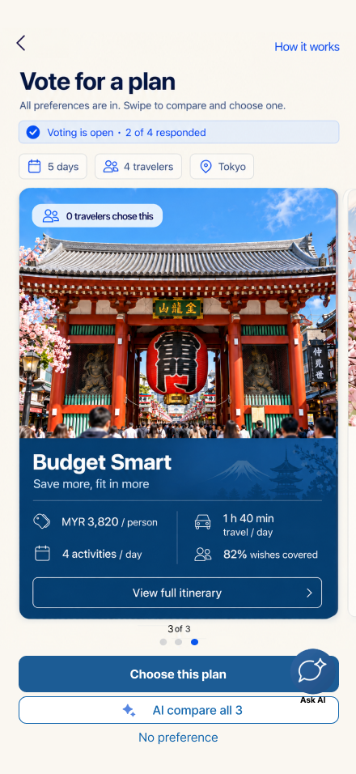</a>

### Frame 17

<a href="assets/additional/frame-17.png">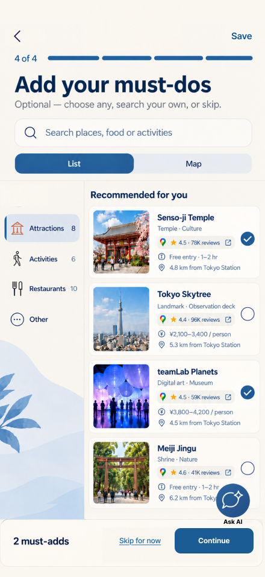</a>

### Frame 29

<a href="assets/additional/frame-29.png">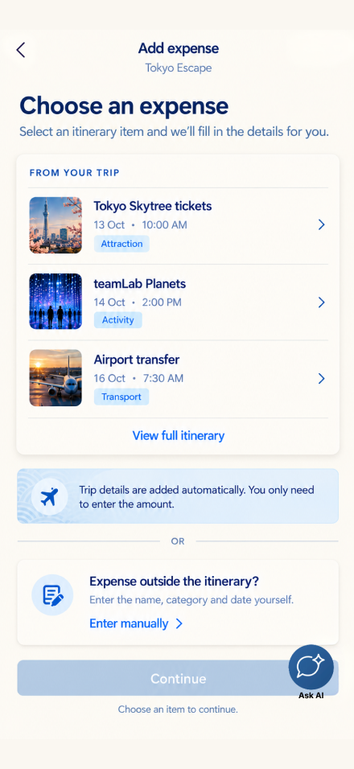</a>

### Frame 57

<a href="assets/additional/frame-57.png">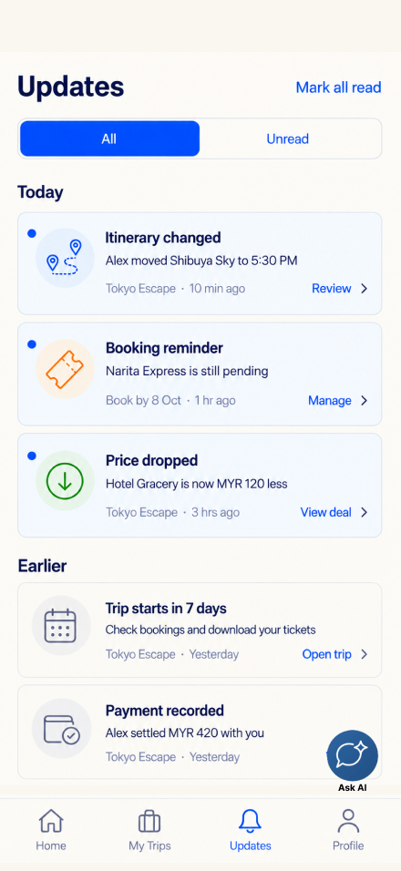</a>

### Frame 6

<a href="assets/additional/frame-6.png">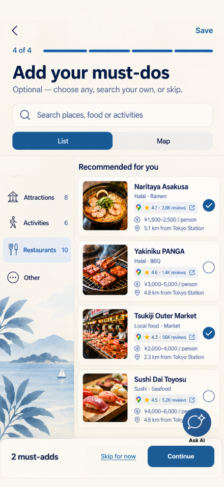</a>

### Frame 7

<a href="assets/additional/frame-7.png">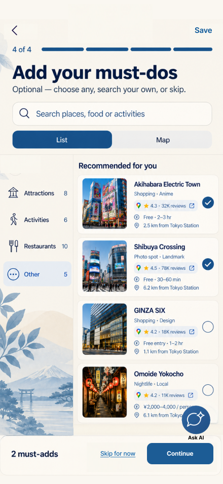</a>

